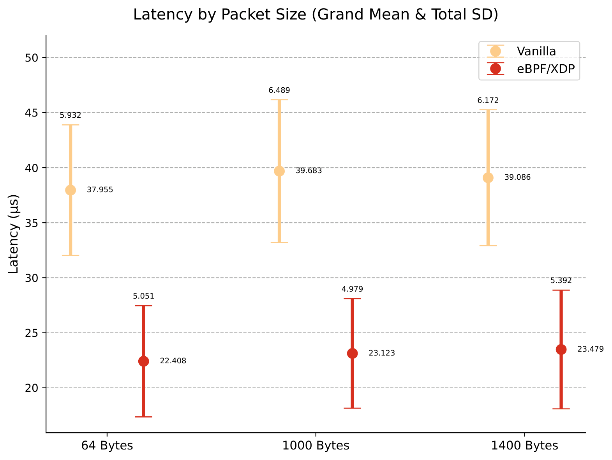
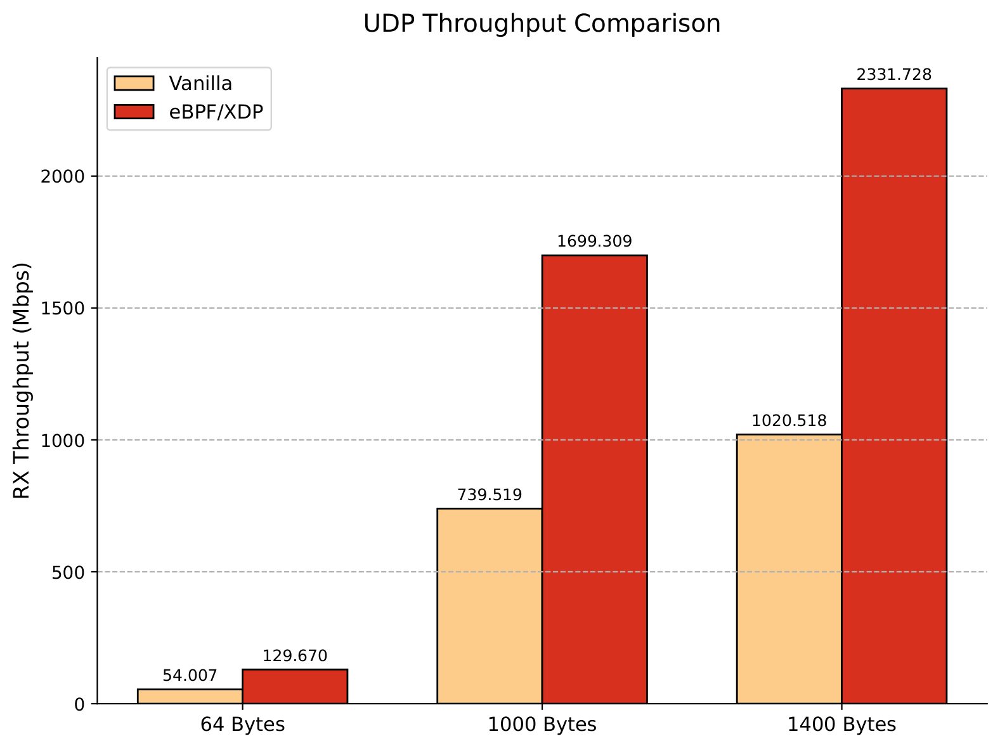
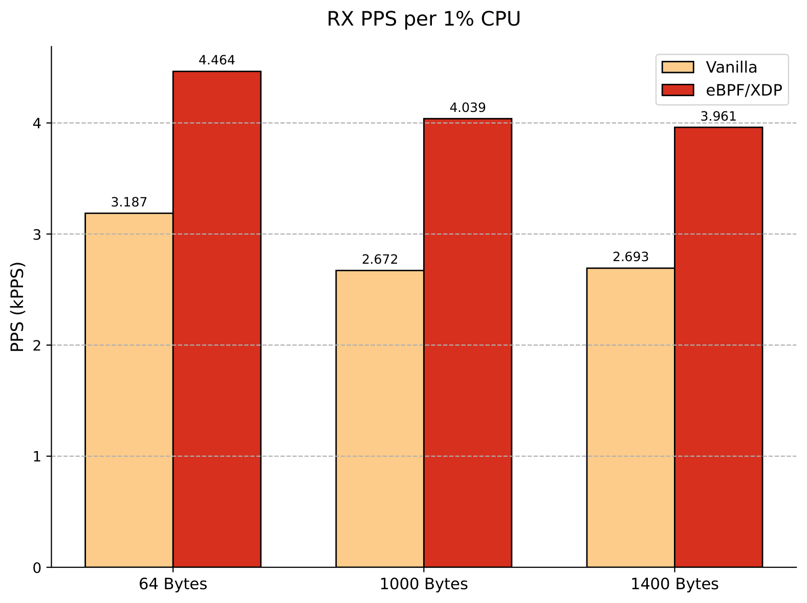

# xdp-natd

A high-performance, eBPF-powered Network Address Translation (NAT) daemon for
containerized environments, implemented in Rust using the Aya eBPF library. Designed
specifically to offload network overhead in container environments, it dynamically
discovers Docker containers and attaches XDP programs to their host-side virtual ethernet
(`veth`) interfaces to perform stateful translation of UDP traffic prior to processing by
the Linux Kernel networking stack to reduce latency and maximize throughput. For
compatibility, TCP traffic falls back to the standard kernel netfilter stack via iptables.
The data path performs dynamic egress routing using Forwarding Information Base (FIB)
lookups and implements incremental checksum recalculation (RFC 1624) to translate IP and
UDP headers.

---

## Performance Results

### Methodology and Testbed Environment

The network performance was evaluated using an isolated micro-benchmarking setup comparing two networking configurations:
1. **Vanilla**: The standard Linux kernel networking stack inside the guest Virtual
     Machines (VMs).
2. **eBPF/XDP (`xdp-natd`)**: The `xdp-natd` solution attached to the host-level `veth`
     interfaces and VM `NIC`s in both guests, mirroring the sender and receiver setups.

#### Testbed Topology
The setup consists of two guest VMs (**Guest A** and **Guest B**) running identical Docker
networks instantiated via the same Docker Compose configuration:
- **Guest A** hosts a container running the benchmarking client tools.
- **Guest B** hosts two containers running their respective target servers.

#### Benchmarking Tools
Measurements were collected for three packet sizes (**64 B, 1000 B, and 1400 B**) using:
- **`sockperf`**: Measures end-to-end one-way latency by timestamping transmit/receive
     events using the CPU's high-resolution timestamp counter.
- **`iperf3`**: Measures maximum UDP throughput.

---

### Statistical Aggregation

#### Latency Calculations
Latency measurements consisted of 10 iterations per packet size, each lasting 60 seconds
in `sockperf`'s `ping-pong` mode. The overall average for each packet size is calculated
as a weighted average to account for varying sample sizes ($n_i$) across runs:

$$ \bar{X}=\frac{\sum_{i=1}^{k}n_i\bar{x}_i}{\sum_{i=1}^{k}n_i} $$

To capture total variance, accounting for both within-run jitter and run-to-run drifts of
the sample mean, the aggregated standard deviation is calculated as:

$$ s_{\mathrm{T}}=\sqrt{\frac{\sum_{i=1}^{k}(n_i-1)s_i^2+\sum_{i=1}^{k}n_i(\bar{x}_i-\bar{X})^2}{\left(\sum_{i=1}^{k}n_i\right)-1}} $$

#### Throughput Calculations
Throughput evaluations with `iperf3` consisted of 10 iterations per packet size, each
lasting 30 seconds. To test the maximum achievable throughput, the `-b 0` flag was used to
send packets as fast as possible. The median value is used to aggregate the results to
filter out transient drops.

---

### Latency

Operating `sockperf` within a Docker container on Guest A to transmit UDP packets to the
server on Guest B, `xdp-natd` demonstrates a significant reduction in one-way latency:
- **64-byte packets**: **41.0% reduction** (from 37.955 µs to 22.408 µs).
- **1000-byte packets**: **41.7% reduction** (from 39.683 µs to 23.123 µs).
- **1400-byte packets**: **39.9% reduction** (from 39.086 µs to 23.479 µs).

Additionally, the standard deviation narrows significantly under eBPF/XDP (e.g., from
6.489 µs to 4.979 µs at 1000 bytes). This narrowing of variance indicates that deploying
`xdp-natd` not only decreases the average transit times but also provides more
deterministic processing times by bypassing variable kernel stack scheduling delays.

---

### Throughput

Using `iperf3` at maximum transmission rates, `xdp-natd` processes UDP packets with
substantial throughput gains over the vanilla networking stack:
- **64-byte packets**: **140.1% improvement** (from 54.007 Mbps to 129.670 Mbps).
- **1000-byte packets**: **129.8% improvement** (from 739.519 Mbps to 1699.309 Mbps).
- **1400-byte packets**: **128.5% improvement** (from 1020.518 Mbps to 2331.728 Mbps).

Deploying `xdp-natd` on the sender side was necessary to generate enough traffic to fully
saturate the receiver, as the vanilla kernel sender could not transmit fast enough to load
the accelerated eBPF receiver.

---

### Processing Efficiency

Receive processing efficiency of the receiving node is calculated as:

$$ \text{Processing Efficiency} = \frac{\text{Packet Processing Rate (PPS)}}{\text{CPU Utilization (\%)}} $$

The evaluations show substantial gains in CPU efficiency under `xdp-natd`:
- **64-byte packets**: **40.1% improvement** (from 3.187 kPPS to 4.464 kPPS per 1% CPU).
- **1000-byte packets**: **51.2% improvement** (from 2.672 kPPS to 4.039 kPPS per 1% CPU).
- **1400-byte packets**: **47.1% improvement** (from 2.693 kPPS to 3.961 kPPS per 1% CPU).

By processing packets at the lowest possible level in the driver, the system avoids
allocating heavy socket buffer (`sk_buff`) structures and bypasses the entire networking
stack traversal. This significantly reduces CPU cycles spent per packet, leaving more
processing resources available to handle incoming traffic.

---

## License

With the exception of eBPF code, `xdp-natd` is distributed under the terms
of either the [MIT license] or the [Apache License] (version 2.0), at your
option.

Unless you explicitly state otherwise, any contribution intentionally submitted
for inclusion in this crate by you, as defined in the Apache-2.0 license, shall
be dual licensed as above, without any additional terms or conditions.

### eBPF

All eBPF code is distributed under either the terms of the
[GNU General Public License, Version 2] or the [MIT license], at your
option.

Unless you explicitly state otherwise, any contribution intentionally submitted
for inclusion in this project by you, as defined in the GPL-2 license, shall be
dual licensed as above, without any additional terms or conditions.

[Apache license]: LICENSE-APACHE
[MIT license]: LICENSE-MIT
[GNU General Public License, Version 2]: LICENSE-GPL2
